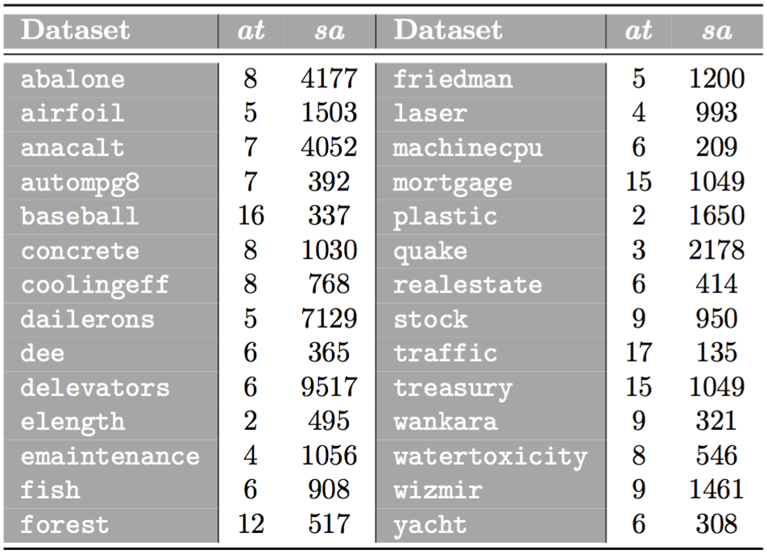

 

This webpage contains complementary material to the research paper:

| | |
|:---|:---|
||José A. Sáez, José L. Romero-Béjar. **Impact of regressand stratification in dataset shift caused by cross-validation**. [Mathematics](https://www.mdpi.com/journal/mathematics). 2022; 10(14):2538.|
| | |

 

The web is organized according to the following summary:

1. [Abstract](#Abstract)
2. [Real-world datasets](#Datasets)
3. [Target shift and error estimation results](#Performance)

 
 
##  1. Abstract
Data that have not been modeled cannot be correctly predicted. Under this assumption, this research studies how k-fold cross-validation can introduce dataset shift in regression problems. This fact implies data distributions in the training and test sets to be different and, therefore, a deterioration of the model performance estimation. Even though the stratification of the output variable is widely used in the field of classification to reduce the impacts of dataset shift induced by cross-validation, its use in regression is not widespread in the literature. This paper analyzes the consequences for dataset shift of including different regressand stratification schemes in cross-validation with regression data. The results obtained show that these allow for creating more similar training and test sets, reducing
the presence of dataset shift related to cross-validation. The bias and deviation of the performance estimation results obtained by regression algorithms are improved using the highest amounts of strata, as are the number of cross-validation repetitions necessary to obtain these better results.
 
##  2. Real-world datasets

This research considers 28 real-world regression datasets taken from the *UCI
machine learning* and *KEEL-dataset* repositories. In order to study the impact of stratification in *k*-fcv with regression problems regardless of the characteristics of the data, datasets belonging to different applications and areas (including fields such as biology, geology, chemistry and so on), an with different numbers of attributes and samples are selected. The next table presents them, along with their number of attributes (*at*) and samples (*sa*). Those samples containing missing values in these datasets are removed before their usage. Furthermore, both the input attributes and the output variable are normalized to the interval [0, 1].

These datasets can be downloaded from the webpages:
- [UCI Machine Learning Repository](https://archive.ics.uci.edu/ml/index.php)
- [KEEL-dataset Repository](http://www.keel.es)

Additionally, these datasets can be downloaded [here](https://github.com/joseasaezm/scvreg/raw/main/docs/data.zip).

 

##  3. Target shift and error estimation results

|||
|:---|:---:|
|&nbsp;&nbsp;&nbsp;**-** *Target shift results (box-plots)* | |
|&nbsp;&nbsp;&nbsp;**-** *Error estimation results* | |
|&nbsp;&nbsp;&nbsp;**-** *Convergence speed plots* | |
|||
